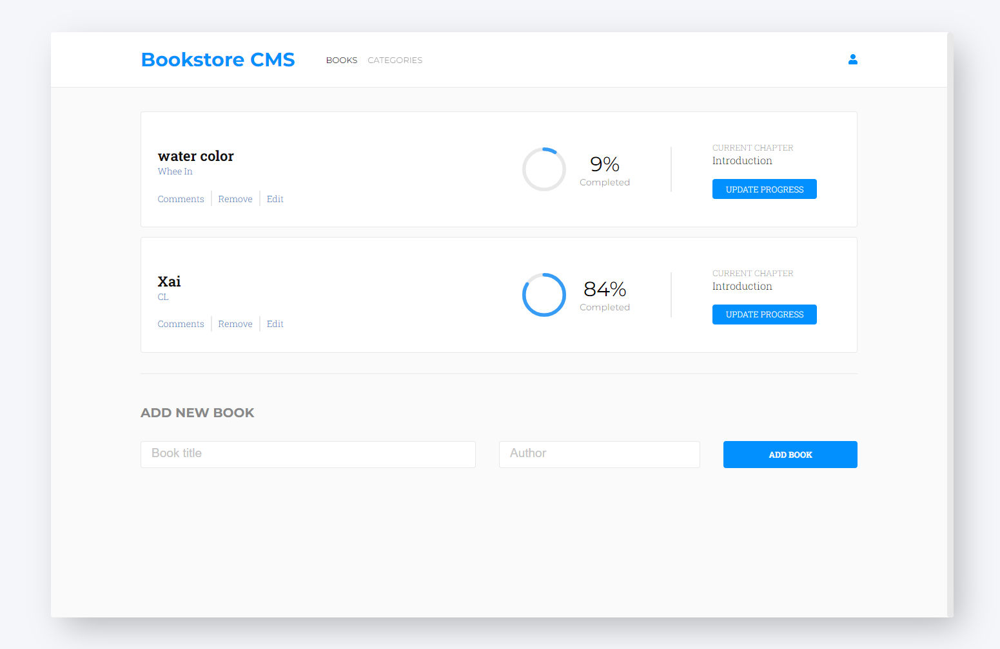

# Bookstore

> It is an app you can use to store your favorite books! You can update them and delete them afterward. All of the books stored in the [Bookstore API](https://www.notion.so/Bookstore-API-51ea269061f849118c65c0a53e88a739)!

  

  

## Built With

- HTML, CSS
- SASS
- React
- Font Awesome
- [Bookstore API](https://www.notion.so/Bookstore-API-51ea269061f849118c65c0a53e88a739)

## Live Demo

- [Click here to see a live version on Netlify!](https://modest-easley-404161.netlify.app)
- [Click here to see a live version on Heroku!](https://bookstore-rdnrn.herokuapp.com/)

## Getting Started

To get a local copy up and running follow these steps:

1. Click the green button "Clone" and choose a preferable way of cloning.
2. Clone the project to your local machine.
3. Open the project folder in your favorite IDE (Preferably Visual Studio Code).
4. Click "View" and choose "Terminal" in the dropdown menu.
5. Enter `npm i` in the terminal to install all dependencies.
6. Enter `npm start` in the terminal to run the project on your local server.

## Author

- GitHub: [@rdnrn](https://github.com/rdnrn)
- LinkedIn: [Nana Rodina](https://www.linkedin.com/in/arina-rodina-144612219/?locale=en_US)
- Twitter: [nana](https://twitter.com/rdnrn_nana)

## 🤝 Contributing

Contributions, issues, and feature requests are welcome!

[You can leave them here!](https://github.com/rdnrn/mathmagicians/issues)

## Show your support

Give a ⭐️ if you like this project!
